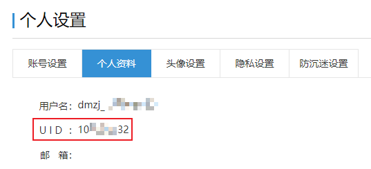
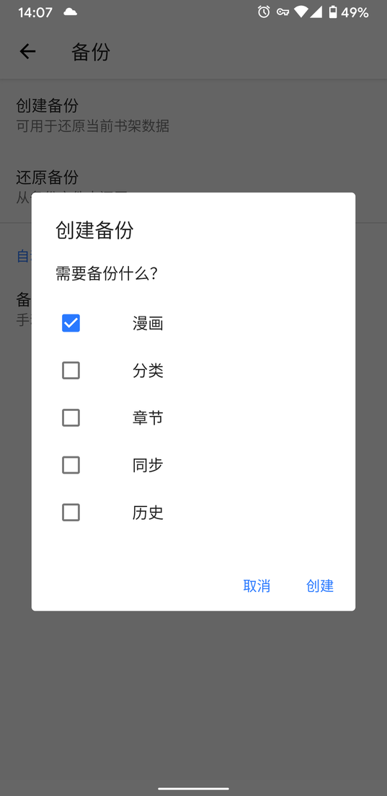
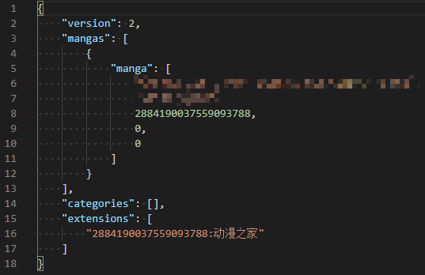
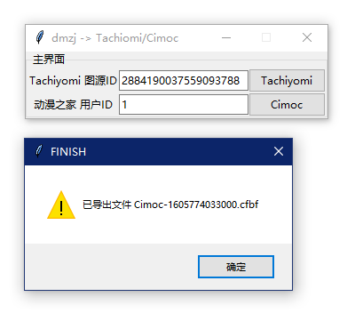

# 动漫之家订阅导出工具

导出动漫之家的漫画订阅到[Tachiyomi](https://github.com/inorichi/tachiyomi) 和 Cimoc([feilongfl](https://github.com/feilongfl/Cimoc)/[Haleydu](https://github.com/Haleydu/Cimoc))

## 使用方式

Cimoc备份路径在 `sdcard\Cimoc\backup`

Tachiyomi备份路径在 `sdcard\Download`

1. 网页端登录[动漫之家](https://i.dmzj.com/my)，找到自己的UID

Cimoc用户可以跳过 2-4 直接导出cfbf文件，在Cimoc中选择恢复备份。

2. 在[Tachiyomi](https://github.com/inorichi/tachiyomi)中添加动漫之家，收藏任一漫画，创建备份

3. 打开备份的json文件，找到 `"extensions": ["2884190037559093788:动漫之家"]`，数字部分即为图源ID

4. 运行本工具，填入图源ID和动漫之家UID，生成json文件，在[Tachiyomi](https://github.com/inorichi/tachiyomi)中选择恢复

5. EOF

## 注意

- Cimoc只确认了目前 [feilongfl](https://github.com/feilongfl/Cimoc)/[Haleydu](https://github.com/Haleydu/Cimoc) 维护的两个分支可以正常导入，其他分支版本可自行测试，理论无异。
- Tachiyomi导入时会联网获取章节信息，对于已失效的漫画会报错，属于正常现象，请查看报错内容自行核对。